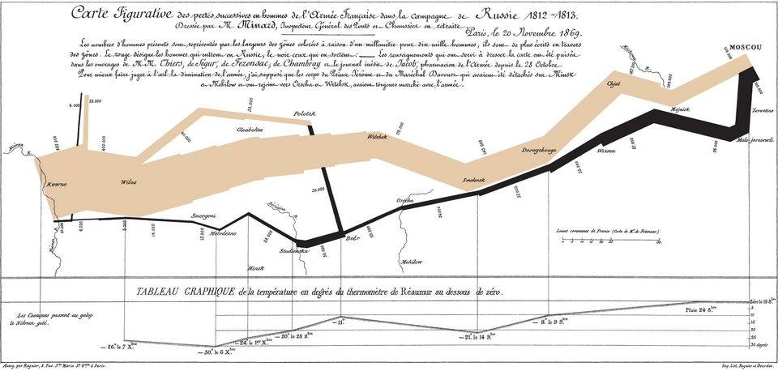
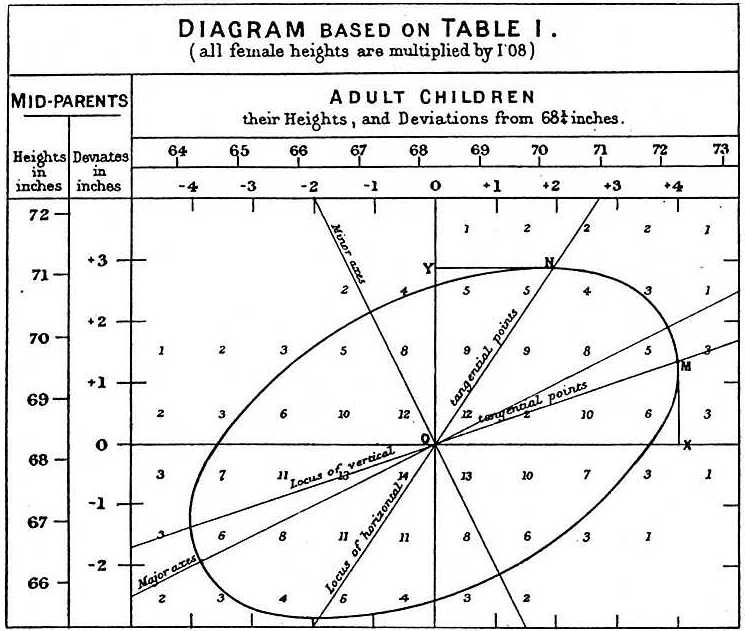
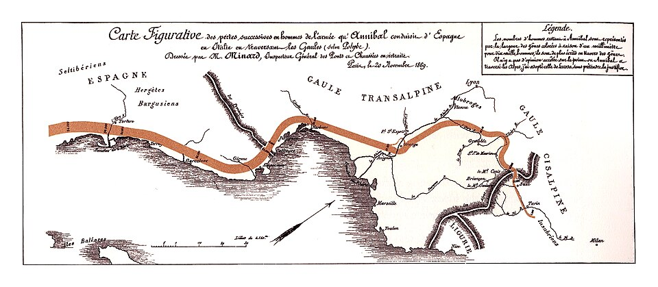

Visualization is a tool for understanding the complex world. Good visualizations give us insights about the world.

## Exploring the World through Data

Visualization is a tool to explore the world through the lens of evidence. By transforming variables into positions, sizes, colors, and other geometric properties, we uncover global patterns, detect outliers, and grasp the inherent characteristics of a dataset. It is the art of translating raw, high-dimensional information into human-perceivable narratives.

**Charles Minard's Map of Napoleon's Russian Campaign (1869)**

Widely regarded as the "best statistical graphic ever drawn," Minard’s map illustrates the catastrophic loss of Napoleon’s army during the 1812 retreat. By integrating geography, troop size, and temperature into a single, seamless flow, it synthesizes multivariate data into a cohesive history. It represents the pinnacle of fact-based visualization, capturing what happened with haunting clarity.

## Understanding the World via Models

Visualization is also a tool to understand the world via models. We project the internal logic and predictive behavior of an algorithm into a visual space, turning abstract functions into interpretable structures. This allows us to validate our assumptions, inspect decision-making processes, and ensure that the models we build are robust, transparent, and trustworthy.

**Francis Galton's Regression toward Mediocrity (1886)**

By plotting parent-child height data and overlaying regression lines, Galton visualized the phenomenon where extreme traits are pulled back toward the population mean over generations. The regression line is the quintessential example of model visualization. It does not merely show the data points; it represents the mathematical extraction of a general relationship—a manifestation of the underlying law governing the noise of reality.

## The Gradient from Data to Models

In practice, the boundary between "data" and "model" is often blurred. Minard’s Napoleon map is not just raw data; the available records do not cover every moment of the march. Minard interpolated the path to weave sparse observations into a continuous, cinematic timeline.

In his visualization of Hannibal’s troop movement, the distinction between data and model dissolves almost entirely. Because direct historical data is so fragmented, the visualization relies heavily on models reconstructed by historians. Here, the "data" we see is already a product of historical inference—an inseparable fusion of fragmented evidence and scholarly reconstruction.

Visualization exists on a gradient of abstraction: Data-heavy visualizations focus on the fidelity of observations. Model-heavy visualizations focus on the clarity of underlying structures. Most insightful visualizations live somewhere in between—using models to filter the noise of data, and using data to ground the abstractions of models, depending on the purpose.
